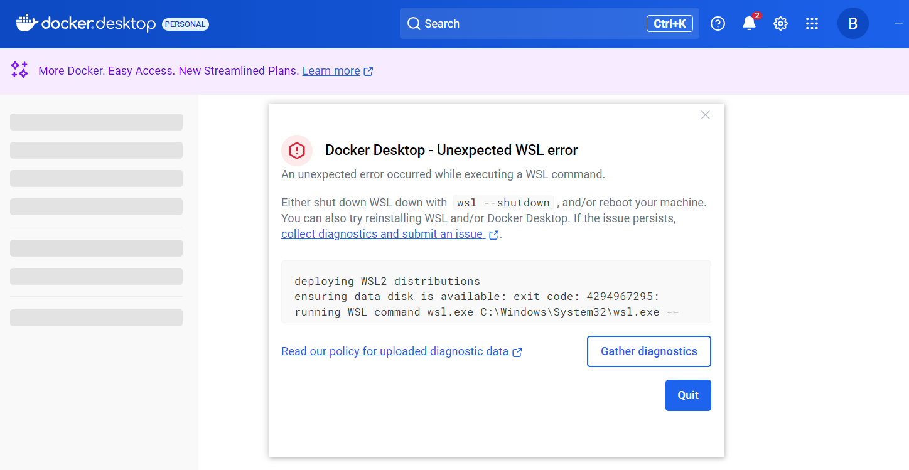
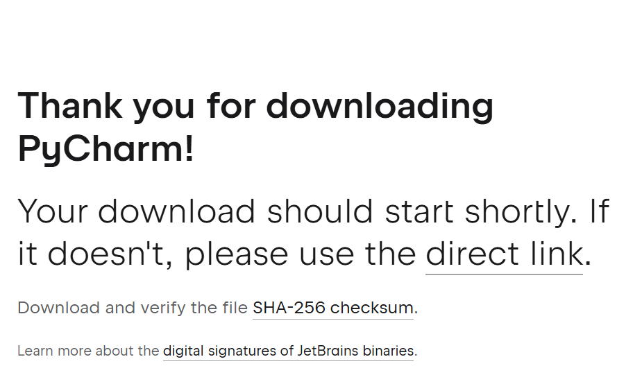

# SGE_BLOC2
# Actividad 5 PYTHON + POSTGRESQL
Guía la configuración de un entorno de desarrollo con Docker, PyCharm y PostgreSQL:
En esta ocación he usado un Ubuntu 20.20 para realizar los siguientes pasos:
Descargaremos Docker desde su página oficial:


Al instalar el docker me ha aparecido el siguiente error:


Para solucionarlo he accedido a esta página y seguí todos los pasos (https://learn.microsoft.com/es-es/windows/wsl/install).

Una vez tengamos Docker instalado y funcionado, procedemos a instalar PyCharm para Python.


Después de instalar PyCharm, comprobaremos que tengamos la versión 3.10. En caso contario tenemos que cambiarla desde la configuración.


Instalaremos el pluggin de Docker, que nos permitirá conectarnos a Docker desde PyCharm y gestionar los contenedores.


Agreagremos el archivo "docker-compose.yml" y lo configuramos con la siguiente información:
- db: Un contenedor que ejecuta PostgreSQL con un usuario, una contraseña y una base de datos preconfigurados.
- pgAdmin: Una interfaz web para gestionar PostgreSQL, accesible desde el navegador en el puerto 80.


Desde PyCharm, ejecutaremos el siguiente comando "sudo docker-compose up -d
"en el archivo "docker-compose.yml", teniendo siempre abierto el Docker Desktop :


Después, accedemos a http://localhost:80 en el navegador y nos registramos con el usuario y la contraseña por defecto puesto en el archivo docker "docker-compose.yml", nos dejará ingresar a pgAdmin 4.


Creamos un servidor de base de datos del bloque 2


En "Connection", ingresaremos los datos del container_name, user y password.


Creamos la carpeta `bloc2_NOMALUMNX` en PyCharm. Posterior, en este directorio, crearemos otra carpeta llamada "postgresql_python". Dentro crearemos los siguientes archivos:

### **connect.py:**


Este archivo establecerá la conexión con la base de datos y poder realizar las operaciones CRUD (Create, Read, Update y Delete) en una tabla de PostgreSQL.
Establece la conexión con PostgreSQL:
```python
import psycopg2
conn = psycopg2.connect(dbname='the_bear', user='admin', password='admin', host='localhost', port=5432)
```

Los datos los he dejado por defecto:
- **Base de datos**: the_bear
- **Usuario**: admin
- **Contraseña**: admin
- **Host**: localhost
- **Puerto**: 5432

Luego, Instalamos las dependencias necesarias:
bash pip install psycopg2 pandas
 en PyCharm es una de las librerías para conectar Python con PostgreSQL, y "pandas" nos permite trabajar con datos en formato de tabla. Además, descargamos el archivo de clientes.csv y lo añadimos en una carpeta con el nombre "send_data_to_db" que estará dentro de la carpeta nuestra carpeta del inicio.

En "send_data_to_db" creamos los archivos:

### **create_table_to_db.py:**


Crea una tabla en la base de datos basada en el archivo ".csv".

### **csv_to_dict.py:**


 Convierte el archivo ".csv" en un diccionario con claves y valores.

### **dict_to_db.py**


Inserta datos en la base de datos a partir del diccionario.

### **create_register.py**


Permite insertar nuevos registros en la base de datos.

### **main.py**


Archivo principal para ejecutar la aplicación.

Comprobación de los datos en pgAdmin
Refrescamos la tabla de clientes en **pgAdmin4** refrescar la tabla de clientes y ejecutarla para que se muestren los datos introducidos.


Finalmente, debemos agregar los últimos códigos CRUD:

### **read_registre.py**


Recupera y muestra todos los registros de la tabla "clientes".

### **update_registre.py**


Modifica datos de un cliente en la base de datos.

### **delete_registre.py**


Elimina un registro específico según su ID.

